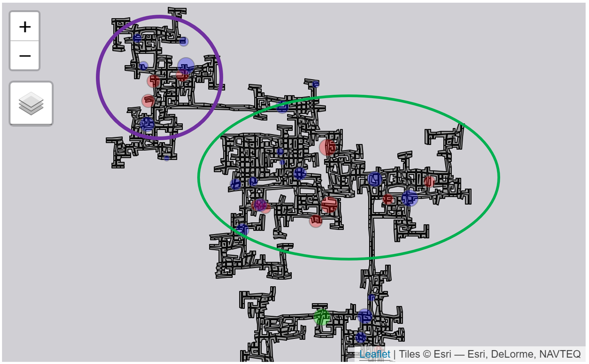

```{r setup, include=FALSE}
knitr::opts_chunk$set(echo = TRUE,
                      eval = TRUE,
                      warning = FALSE,
                      message = FALSE)
```

# 1. Overview

As part of Challenge 2 of VAST Challenge 2022, we are required to characterize 
the distinct areas of the city identified. Sub-questions to consider: 

● Where are the busiest areas in Engagement?

● Are there traffic bottlenecks that should be addressed?

# 2. Getting Started
Before we get started, it is important for us to ensure that the required R packages have been installed. If yes, we will load the R packages. If they have yet to be installed, we will install the R packages and load them onto R environment.

The chunk code below will do the trick.

```{r}
packages = c('tidyverse', 'lubridate', 'sf','tmap', 'sftime', 
             'lubridate', 'rmarkdown', 'clock')
for(p in packages){
  if(!require(p, character.only = T)){
    install.packages(p)
  }
  library(p, character.only = T)
}
```

# 3. Busiest Area

In addressing the first sub-questions in identifying which areas are the busiest,
we will denote this as areas with high check in rates.

## 3.1. Load the data

The data that will be used to examine the busiest area are:

● *TravelJournal* - to obtain the location visited by the participants 
                    throughout the study.

● *Schools* - to get the location of the schools for plotting

● *Pubs* - to get the location of the pubs for plotting

● *Restaurants* - to get the location of the restaurants for plotting

● *Apartments* - to get the location of the apartments for plotting

● *Employers* - to get the location of the workplaces for plotting

```{r}
travel <- read_csv("data/TravelJournal.csv")

schools <- read_sf("data/wkt/Schools.csv", options = "GEOM_POSSIBLE_NAMES=location")

pubs <- read_sf("data/wkt/Pubs.csv", options = "GEOM_POSSIBLE_NAMES=location")

apartments <- read_sf("data/wkt/Apartments.csv", options = "GEOM_POSSIBLE_NAMES=location")

buildings <- read_sf("data/wkt/Buildings.csv", options = "GEOM_POSSIBLE_NAMES=location")

employers <- read_sf("data/wkt/Employers.csv", options = "GEOM_POSSIBLE_NAMES=location")

restaurants <- read_sf("data/wkt/Restaurants.csv", options = "GEOM_POSSIBLE_NAMES=location")
```

## 3.2. Data preparation

### 3.2.1 Obtain new fields and select required fields

1. Extract the weekday data from the *checkInTime*. This *Weekday* data will be
used to examine if there is a different pattern in terms of busiest area on the 
weekend and the weekday.

2. As the *travelStartLocationId* and *travelEndLocationId* both have numeric
data type, we will convert them into characters so that it can be later join to
the other datasets (e.g. pubs, schools, etc.) in which the data type are in 
characters. Furthermore, both fields should not be in numeric data type as the 
numbers do not have any meaning based on the continuous scale but rather
used as a reference code to identify distinct places.
Additionally, we will shorten the column names of both fields for easy calling.

3. We will then select the relevant fields needed for our visualization.

```{r}
travel <- travel %>% mutate(Weekday = wday(checkInTime, label = TRUE))%>% 
  mutate(venueId = as.character(travelEndLocationId)) %>%
  mutate(originId = as.character(travelStartLocationId)) %>%
  select(participantId, originId, venueId, checkInTime, Weekday)
```

### 3.2.2 Save the file in rds

Due to the large data found in *TravelJournal* and the memory limit in github, 
we will store the compressed version of the data in rds format.

```{r eval=FALSE}
write_rds(travel, 
          "data/rds/travel.rds")
```

### 3.2.3 Load the data for further processing

```{r}
travel <- read_rds("data/rds/travel.rds")
```

## 3.3. Overview of busiest areas

### 3.3.1. Obtain the no. of visitors

We will first consider the busiest areas throughout the study. Thus, we will 
group the travel data by the *venueId* (which is the *travelEndLocationId*) and 
obtain the number of visitors for each *venueId*. The reason why *originId* is 
not considered, is to avoid double counting.

```{r}
No_visitors <- travel %>% group_by(venueId) %>% summarise(visitors = n())
```

### 3.2.2. Join with pubs to get the location

As the travel data does not have the coordinate points for plotting, we will 
need to join with the respective location file to get it for plotting.

```{r}
pub_v <- left_join(pubs, No_visitors, by = c('pubId' = 'venueId'))
restaurants_v <- left_join(restaurants, No_visitors, by = c('restaurantId' = 'venueId'))
employers_v <- left_join(employers, No_visitors, by = c('employerId' = 'venueId'))
schools_v <- left_join(schools, No_visitors, by = c('schoolId' = 'venueId'))
apartments_v <- left_join(apartments, No_visitors, by = c('apartmentId' = 'venueId'))
```


### 3.2.3. Plot the areas

For the visualization of geo-spatial data, we will use [**tmap**](https://r-tmap.github.io/tmap/index.html).

```{r}
tmap_mode("view")
tm_shape(buildings)+
tm_polygons(col = "grey60",
           size = 2,
           border.col = "black",
           border.lwd = 1) +
tm_shape(pub_v) +
  tm_bubbles(col = "red",
             size = "visitors",
             alpha = 0.3) +
tm_shape(restaurants_v) +
  tm_bubbles(col = "blue",
             size = "visitors",
             alpha = 0.3) +
tm_shape(employers_v) +
  tm_bubbles(col = "yellow",
             size = "visitors",
             alpha = 0.3) +
tm_shape(schools_v) +
  tm_bubbles(col = "green",
             size = "visitors",
             alpha = 0.3) +
tm_shape(apartments_v) +
  tm_bubbles(col = "pink",
             size = "visitors",
             alpha = 0.3)
tmap_mode("plot")
```
*Figure 1*

With **Tmap** users are able to zoom in and out of the plots, select and 
deselect the different location layers for deeper investigation and even hover
to see building details. 



Based on *Figure 2*, we notice that the central (green circle) and the 
north-western area (purple circle) tends to be more pack with pubs and restaurants.

Pubs 1342 and 1344 found within the green circle have 2 of the biggest circle,
indicating that these 2 are the hihgly visited pubs in the area. Perhaps, it is 
due to the centrality of the location, it is much convenient area for the 
participants to socialise.

RestaurandId 1801, 1805 and 449 are the top 3 restaurant in the city of Engagement,
with both restaurant 1801 and 1805 located within the purple circle.


## 3.4. Busiest areas on weekends

### 3.4.1 Data preparation

1. Filter to contain only Saturdays and Sundays data.

2. Group by the *venueId* to compute the number of visitors at each venue 
throughout the weekends.

```{r}
No_visitors_wEnd <- travel %>% 
  filter(Weekday == "Sat" |Weekday == "Sun") %>%
  group_by(venueId) %>%
  summarise(visitors = n())
```

3. Left join with location data to get the coordinates for plotting.

```{r}
pub_wEnd <- left_join(pubs, No_visitors_wEnd, by = c('pubId' = 'venueId'))
restaurants_wEnd <- left_join(restaurants, No_visitors_wEnd, by = c('restaurantId' = 'venueId'))
employers_wEnd <- left_join(employers, No_visitors_wEnd, by = c('employerId' = 'venueId'))
schools_wEnd <- left_join(schools, No_visitors_wEnd, by = c('schoolId' = 'venueId'))
```

### 3.4.2. Plot weekend data

```{r}
tmap_mode("view")
tm_shape(buildings)+
tm_polygons(col = "grey60",
           size = 2,
           border.col = "black",
           border.lwd = 1) +
tm_shape(pub_wEnd) +
  tm_bubbles(col = "red",
             size = "visitors",
             alpha = 0.3) +
tm_shape(restaurants_wEnd) +
  tm_bubbles(col = "blue",
             size = "visitors",
             alpha = 0.3) +
tm_shape(employers_wEnd) +
  tm_bubbles(col = "yellow",
             size = "visitors",
             alpha = 0.3) +
tm_shape(schools_wEnd) +
  tm_bubbles(col = "green",
             size = "visitors",
             alpha = 0.3) 
tmap_mode("plot")
```
*Figure 3* 

## 3.5. Busiest areas on weekday

### 3.5.1 Data preparation

1. Filter to exclude Saturdays and Sundays data.

2. Group by the *venueId* to compute the number of visitors at each venue 
throughout the weekdays.

```{r}
No_visitors_wDay <- travel %>% filter(Weekday != "Sat") %>%
  filter(Weekday != "Sun") %>%
  group_by(venueId) %>%
  summarise(visitors = n())
```

3. Left join with location data to get the coordinates for plotting.

```{r}
pub_wDay <- left_join(pubs, No_visitors_wDay, by = c('pubId' = 'venueId'))
restaurants_wDay <- left_join(restaurants, No_visitors_wDay, by = c('restaurantId' = 'venueId'))
employers_wDay <- left_join(employers, No_visitors_wDay, by = c('employerId' = 'venueId'))
schools_wDay <- left_join(schools, No_visitors_wDay, by = c('schoolId' = 'venueId'))
```

### 3.5.2. Plot for weekdays

```{r}
tmap_mode("view")
tm_shape(buildings)+
tm_polygons(col = "grey60",
           size = 2,
           border.col = "black",
           border.lwd = 1) +
tm_shape(pub_wDay) +
  tm_bubbles(col = "red",
             size = "visitors",
             alpha = 0.3) +
tm_shape(restaurants_wDay) +
  tm_bubbles(col = "blue",
             size = "visitors",
             alpha = 0.3) +
tm_shape(employers_wDay) +
  tm_bubbles(col = "yellow",
             size = "visitors",
             alpha = 0.3) +
tm_shape(schools_wDay) +
  tm_bubbles(col = "green",
             size = "visitors",
             alpha = 0.3) 
tmap_mode("plot")
```
*Figure 4*

We observe that the yellow circles representing employers in more prominenet in 
*Figure 4* than in *Figure 3*, indicating that there are lesser participants
working on the weekends.


## 5. Traffic bottlenecks

### 5.1 Data preparation

#### 5.1.1 Load the ParticipantLog data

```{r}
logs <- read_sf("data/wkt/ParticipantStatusLogs1.csv", options = "GEOM_POSSIBLE_NAMES=currentLocation")
```


#### 5.1.2. Format timestamp data and get the day data

```{r}
logs_selected <- logs %>% mutate(Timestamp = date_time_parse(timestamp,
                                                             zone = "",
                                                             format = "%Y-%m-%dT%H:%M:%S")) %>% 
  mutate(day = get_day(Timestamp)) %>% 
  filter(currentMode == "Transport")
```

#### 5.1.3. Get the path of each participant

To obtain the path traveled by each participant for each day, we will need to 
`group_by` the *paticipantId* and *day* followed by summarizing it by their mean
timestamp and to cast it into a **LINESTRING** format.

```{r}
logs_path <- logs_selected %>%
  group_by(participantId, day) %>%
  summarize(m = mean(Timestamp), 
            do_union=FALSE) %>%
  st_cast("LINESTRING")
```

### 5.2. Plot the path for day 2

```{r}
logs_path_selected <- logs_path %>%
  filter(day == 2)

tmap_mode("view")
tm_shape(buildings)+
tm_polygons(col = "grey60",
           size = 1,
           border.col = "black",
           border.lwd = 1) +
  tm_shape(logs_path_selected) +
  tm_lines(col = "participantId") +
  tm_layout(legend.show=FALSE)
tmap_mode("plot")
```
*Figure 5*

The combined thickness of all the lines depicts the commonly used routes by the participants.
